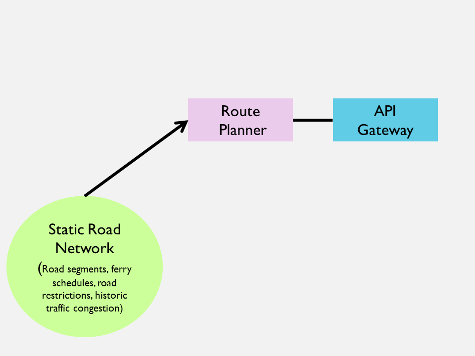

# BC Route Planner
BC Route Planner is an open source route planner with support for time-dependent routing and truck routing on the BC Integrated Transportation Network. [Source code](https://github.com/bcgov/ols-router) is licensed under [Apache 2.0](https://www.apache.org/licenses/LICENSE-2.0). Route Planner version 2.1 was released on March 31, 2020. To see it in use by an application, visit [Location Services in Action](https://ols-demo.apps.gov.bc.ca/index.html?rt=dlv&gc=dlv).

The BC Route Planner is being developed by the Province of British Columbia in a three-year project called Route Planner NG (RPNG). We are just wrapping up year one.

In year one (2018-19), we investigated the feasibility of supporting multiple complex routing constraints such as time-dependent routing including historic traffic congestion, scheduled road events and construction, and ferry schedules. The first release includes components for which there is insufficient or no real data so that a stable API is available for developers sooner than later. Such components are turned off by default. Creating and managing data sources is out of scope of this project. Getting data custodians to put usable data APIs in place was not expected and didn't happen. The performance goal of the Route Planner 2.0, the first release of RPNG, is under two seconds execution time for a single, two-point route for an oversized truck.

In year two (2019-2020), we added support for vehicle-size dependent routing (aka truck routing).Truck routing takes vehicle and load dimensions and road restrictions into account. A road watcher will be implemented to keep the cached road network in-synch with real-time events like construction, traffic congestion, ferry delays, accidents, wildfires, and mudslides

In year three (2020), we will add support for real-time road events and ferry schedules. A road watcher will be implemented to keep the cached road network in-synch with real-time events like construction, traffic congestion, ferry delays, accidents, wildfires, and mudslides.

In year three (2020-2021), we will focus on incorporating user-requested enhancements, making routes more realistic, and improving performance.

[Route Planner 2.1 in action](https://ols-demo.apps.gov.bc.ca/index.html?rt=dlv&gc=dlv)

[Route Planner release notes](rpng-release-notes.md)

[Route Planner NG Acceptance Test Plan](rpng-atp.md)

[Draft Integrated Transportation Network Data Model Gaps](ITN-Data-Mode-Gaps.md)

[Draft Integrated Transportation Network Data Issues](itn-data-issues.md)

[Current milestones for this year](https://github.com/bcgov/ols-router/milestones)

Project status as of: 
[2019-03-29](rpng-2019-status-16.md) 
[2019-03-13](rpng-2019-status-15.md) 
[2019-02-19](rpng-2019-status-14.md) 
[2019-01-28](rpng-2019-status-13.md) 
[2019-01-04](rpng-2019-status-12.md) 
[2018-12-14](rpng-2018-status-11.md) 
[2018-11-30](rpng-2018-status-10.md) 
[2018-11-16](rpng-2018-status-9.md) 
[2018-10-26](rpng-2018-status-8.md) 
[2018-10-10](rpng-2018-status-7.md) 
[2018-09-20](rpng-2018-status-6.md) 
[2018-09-06](rpng-2018-status-5.md) 
[2018-08-14](rpng-2018-status-4.md) 
[2018-07-26](rpng-2018-status-3.md) 
[2018-07-13](rpng-2018-status-2.md) 
[2018-06-15](rpng-2018-status-1.md) 

[Promising routing algorithms](https://github.com/bcgov/ols-router/issues/25)

[Comparison between ITN and OSM](osm-itn-stats.md)

## Draft Phase 1 System Architecture
The BC Route Planner NG is a web service (aka API) running behind Kong, our API Gateway. Kong is an NGINX plugin that provides security and access control, metering, and load balancing. Multiple route planner nodes will be deployed across multiple data centres to ensure service is not interrupted during scheduled maintenance or data centre failure.

On startup, a Route Planner node will read the latest static road network into a cached road network. Route Planner nodes will be restarted monthly when updated ITN data is received and prepared for use. Historic traffic congestion, road events, and ferry schedules are all cooked data designed solely for proof-of-concept.

## Draft Phase 2 System Architecture
In phase 2, the system architecture will be enhanced to support real-time changes to BC's road network.

On startup, the Road Watcher will read in the latest static road network then read in the latest events from real-time APIs on a periodic schedule (e.g., every five minutes) and assign them to the appropriate segments in the network. It will then convert the integrated events into a form that is easily digestable by the Route Planner and write them out to a shared datastore that is accessible to all Route Planner nodes.  Individual Route Planner nodes will pull events from the shared datastore every few minutes. 

The Road Watcher will be restarted on a schedule that keeps up with new road construction and changes to road signs and traffic controls.

