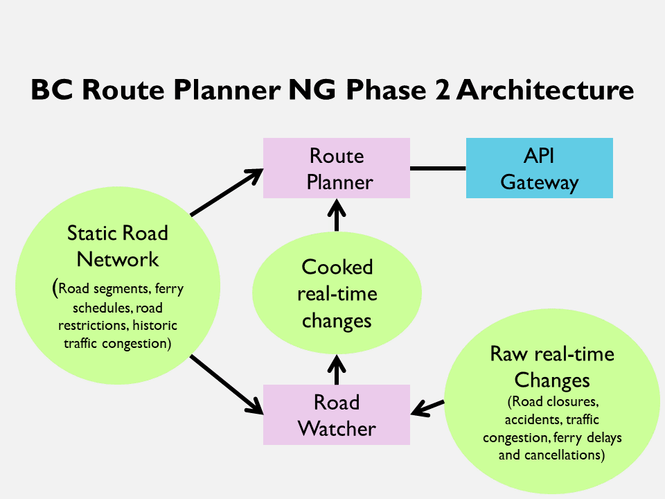

# BC Route Planner NG
BC Route Planner NG is a three year project of the Province of British Columbia to develop a state-of-the art route planner. The BC Route Planner NG is a vital component of the free and open Frugal Maps BC Platform.

In year 1 (2018-19), we will investigate the feasibility of supporting multiple complex routing constraints such as time-dependent routing including historic traffic congestion, scheduled road events and construction, and ferry schedules. The first release will include components for which there is insufficient or no real data so that a stable API will be available for developers sooner than later. Such components will be turned off by default. Creating and managing data sources is out of scope of this project. Getting data custodians to put usable data APIs in place is not expected this year. The performance goal of the first release of RPNG is under two seconds execution time for a single, two-point route for an oversized truck. 

In year 2 (2019-2020), we will add support for truck routing, real-time road events, areas of exclusion,and new data sources. Truck routing takes vehicle dimensions and road restrictions into account. A road watcher will be implemented to keep the cached road network in-synch with real-time events like construction, traffic congestion, ferry delays, accidents, wildfires, and mudslides

In year 3 (2020-2021), we will focus on incorporating user-requested enhancements, making routes more realistic, and improving performance.

[Current milestones for this year](https://github.com/bcgov/ols-router/milestones)

Project status as of: 
[2019-03-13](rpng-2019-status-15.md) 
[2019-02-19](rpng-2019-status-14.md) 
[2019-01-28](rpng-2019-status-13.md) 
[2019-01-04](rpng-2019-status-12.md) 
[2018-12-14](rpng-2018-status-11.md) 
[2018-11-30](rpng-2018-status-10.md) 
[2018-11-16](rpng-2018-status-9.md) 
[2018-10-26](rpng-2018-status-8.md) 
[2018-10-10](rpng-2018-status-7.md) 
[2018-09-20](rpng-2018-status-6.md) 
[2018-09-06](rpng-2018-status-5.md) 
[2018-08-14](rpng-2018-status-4.md) 
[2018-07-26](rpng-2018-status-3.md) 
[2018-07-13](rpng-2018-status-2.md) 
[2018-06-15](rpng-2018-status-1.md) 

[Draft year 1 Route Planner release notes](https://github.com/bcgov/ols-router/issues/75)

[Route Planner NG Acceptance Test Plan](rpng-atp.md)

[Draft Integrated Transportation Network Data Model Gaps](ITN-Data-Mode-Gaps.md)

[Promising routing algorithms](https://github.com/bcgov/ols-router/issues/25)

## Route Planner NG Year 1 Feature Matrix

Feature                | Disabled by Default| Feature Quality | Data Needed            |Data Quality          
|----------------------|:---------:|------------------|-----------------------|----------------------|
Correct-side routing|No|Good|Road geometry from ITN and address ranges from BC Address Geocoder|Excellent|
Time independent turn restrictions|Yes|Supports No-U-Turns, no very sharp turns but demo only due to poor explicit turn-restrictions in ITN|[Implicit restrictions](https://www.mapbox.com/mapping/mapping-for-navigation/implicit-restrictions/) Explicit restrictions from ITN (e.g., based on observed road signs)|Implicit restrictions: high  Explicit restrictions: Poor. The data is often out of date or missing restrictions all together.
Start time|Yes|Good|All time-dependent data|variable|
Time-dependent turn-restrictions|Yes|Functionally good but demo only due to poor data|Time-dependent turn restrictions from ITN|Poor. There are many missing time-dependent turn-restrictions in the data.
Turn costs|Yes|Demo only; not tuned for realism and double penalizing in divided intersections|Turn cost estimates by turn type (left,right,straight) traffic impactor (yield, stop, light)  intersection approach/departure (slowing down,speeding up)| acceptable
Designated truck routes|Yes|Demo only; Only supports a basic designated truck route, not weight or height corridors hazardous material routes, or evacuation routes|Designated truck routes from ITN| Poor; only a handful of truck route segments in the province (a few in Ft St John)
Scheduled Road Events|Yes|Demo only; no real-time event monitoring, only full road closure events, not lane closures or info events| Scheduled road closure events from static Open511 file loaded on reboot|Good for some events; too much descriptive text, not enough structured time intervals
Historic traffic congestion|Yes|Demo only|historic traffic data for each road segment in urban areas|Poor; In the absense of real data, simulated traffic peaks were generated for rush hour only.
Hard road restrictions|Yes|Demo only; no support for height/weight restrictions by lane or rig type|road minimum height and weight(GVW) from ITN road width|Height, weight: Unknown; very few values width: no data in ITN, demo data only
Ferry schedules|Yes|Demo only due to fake data; loads ferry schedules from GTFS files|Suitable for demo only; BC Ferries doesn't provide GTFS so we created GTFS file for winter schedules of two ferry routes

Note: Features can be enabled/disabled on a per route planner request basis.

## Draft Phase 1 System Architecture
The BC Route Planner NG is a web service (aka API) running behind Kong, our API Gateway. Kong is an NGINX plugin that provides security and access control, metering, and load balancing. Multiple route planner nodes will be deployed across multiple data centres to ensure service is not interrupted during scheduled maintenance or data centre failure.

On startup, a Route Planner node will read the latest static road network into a cached road network. Route Planner nodes will be restarted monthly when updated ITN data is received and prepared for use. Historic traffic congestion, road events, and ferry schedules are all cooked data designed solely for proof-of-concept.

## Draft Phase 2 System Architecture
In phase 2, the system architecture will be enhanced to support real-time changes to BC's road network.

On startup, the Road Watcher will read in the latest static road network then read in the latest events from real-time APIs on a periodic schedule (e.g., every five minutes) and assign them to the appropriate segments in the network. It will then convert the integrated events into a form that is easily digestable by the Route Planner and write them out to a shared datastore that is accessible to all Route Planner nodes.  Individual Route Planner nodes will pull events from the shared datastore every few minutes. 

The Road Watcher will be restarted on a schedule that keeps up with new road construction and changes to road signs and traffic controls.

